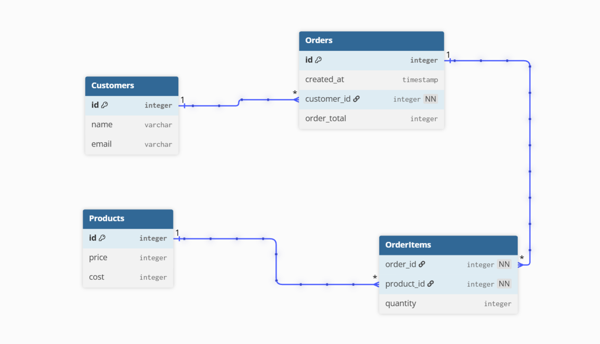

# Database-Diagram-Assessment
Includes the DBML used to create a Database Diagram for my CP05 assessment


```
//Primary entities
Table Customers {
  id integer [primary key]
  name varchar
  email varchar
}

Table Orders {
  id integer [primary key]
  created_at timestamp
  customer_id integer [not null]
  order_total integer
}

Table Products {
  id integer [primary key]
  price integer
  cost integer
}
//Join Table
Table OrderItems {
  order_id integer [not null]
  product_id integer [not null]
  quantity integer
}

//Relationships
Ref: "Customers"."id" < "Orders"."customer_id"

Ref: "OrderItems"."order_id" > "Orders"."id"

Ref: "OrderItems"."product_id" > "Products"."id"
```


